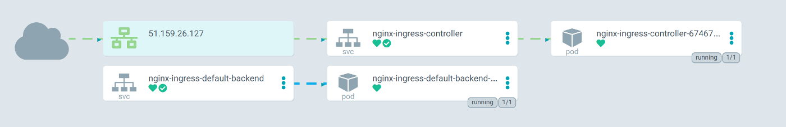

# GitOps-Kubernetes-cluster

For more boiler plate examples and a complete Kubernetes setup checkout: https://github.com/AlexsJones/kube-microcosm


A snapshot of a cluster configuation I've used running on Scaleway.
It leverages ArgoCD to pull in a Helm chart that launches additional ArgoCD applications.


## Bootstrap

- `make install-argocd`


The bootstrap process will install the Applications into GitOps as CRD.




### Optional ingress


`make install-cert-manager`

Once installed you can use cert-manager to install certs for grafana/argocd.

You will see the `resources` folder is tailored to my certs and domain names - make it your own and alter it.

```
make install-argocd-ingress
make install-grafana-ingress
```
