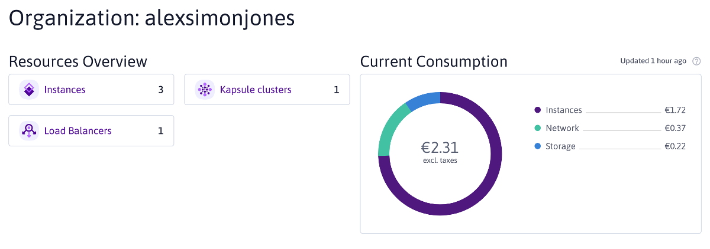
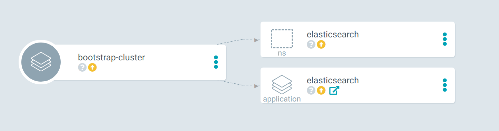
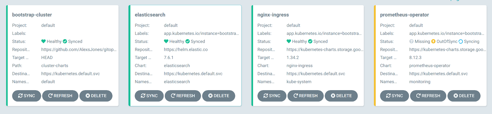

# GitOps-Kubernetes-cluster

A snapshot of a cluster configuation I've used running on Scaleway.
It leverages ArgoCD to pull in a Helm chart that launches additional ArgoCD applications.

## Bootstrap

- Generate certs for grafana & argocd with lets-encrypt
  - keys/grafana.cert
  - keys/grafana.key
  - keys/argocd.key
  - keys/argocd.cert
- `make install-argocd`
- `make install-prometheus-ingress`
- Navigate to argocd.example.com and run a bootstrap application sync.

The bootstrap process will install the Applications into GitOps as CRD.

